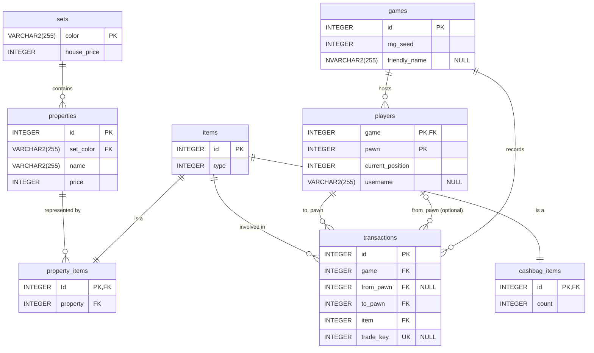

# Proiect Baze de Date

The diagram below models a database that stores games of Monopoly, and their
intermediate states.

```mermaid
erDiagram
    %% Relationships
    sets ||--o{ properties : "contains"
    games ||--o{ players : "hosts"
    games ||--o{ transactions : "records"
    players |o--o{ transactions : "from_pawn (optional)"
    players ||--o{ transactions : "to_pawn"
    items ||--o{ transactions : "involved in"
    
    %% Inheritance/Subtypes
    items ||--|| property_items : "is a"
    items ||--|| cashbag_items : "is a"
    
    %% Other Relations
    properties ||--o{ property_items : "represented by"

    %% Tables
    sets {
        VARCHAR2(255) color PK
        INTEGER house_price
    }

    properties {
        INTEGER id PK
        VARCHAR2(255) set_color FK
        VARCHAR2(255) name
        INTEGER price
    }

    games {
        INTEGER id PK
        INTEGER rng_seed
        NVARCHAR2(255) friendly_name "NULL"
    }

    players {
        INTEGER game PK, FK
        INTEGER pawn PK
        INTEGER current_position
        VARCHAR2(255) username "NULL"
    }

    transactions {
        INTEGER id PK
        INTEGER game FK
        INTEGER from_pawn FK "NULL"
        INTEGER to_pawn FK
        INTEGER item FK
        INTEGER trade_key UK "NULL"
    }

    items {
        INTEGER id PK
        INTEGER type
    }

    property_items {
        INTEGER Id PK, FK
        INTEGER property FK
    }

    cashbag_items {
        INTEGER id PK, FK
        INTEGER count
    }
```
